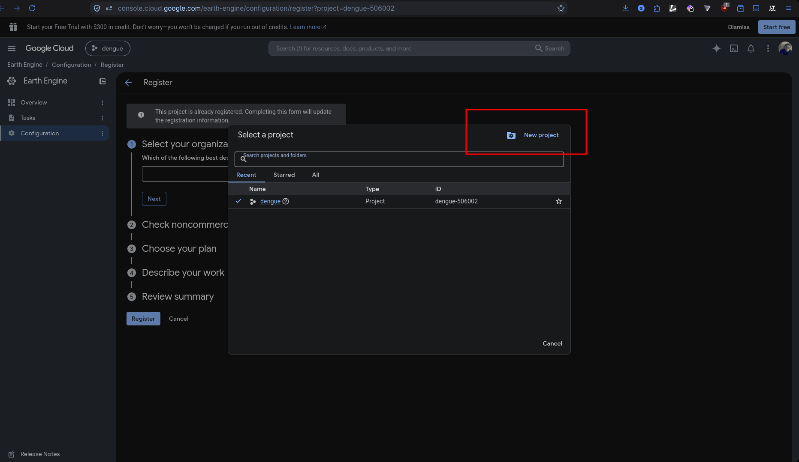
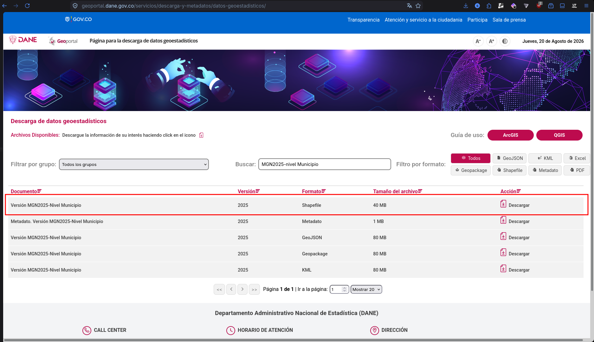
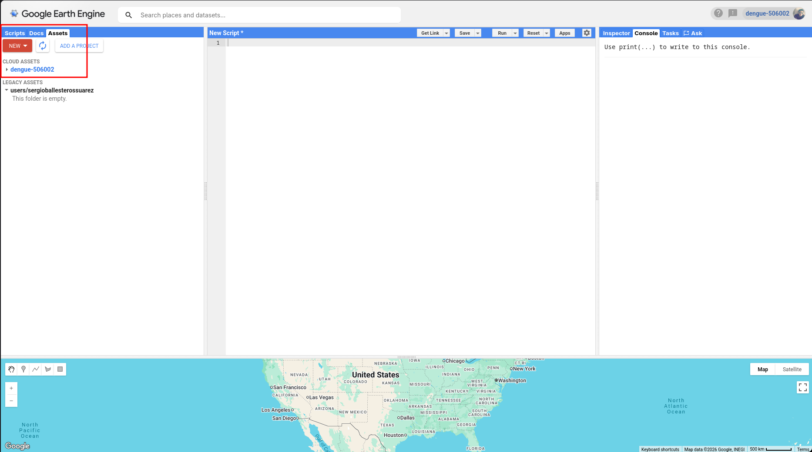
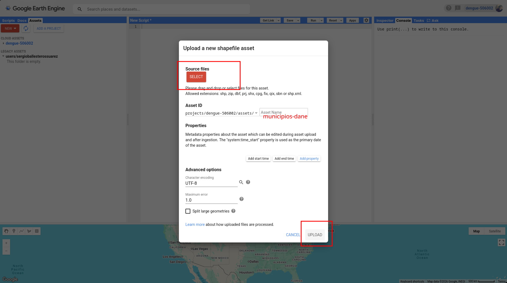
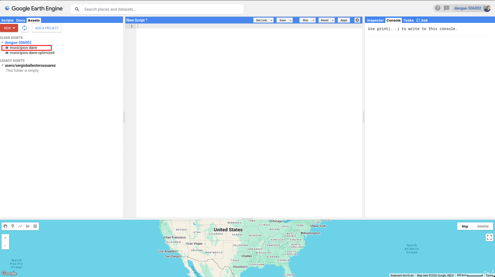
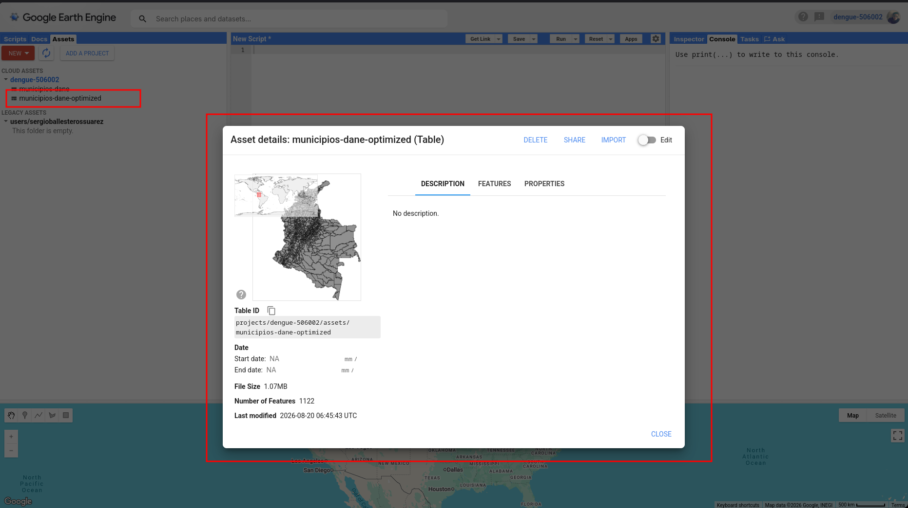
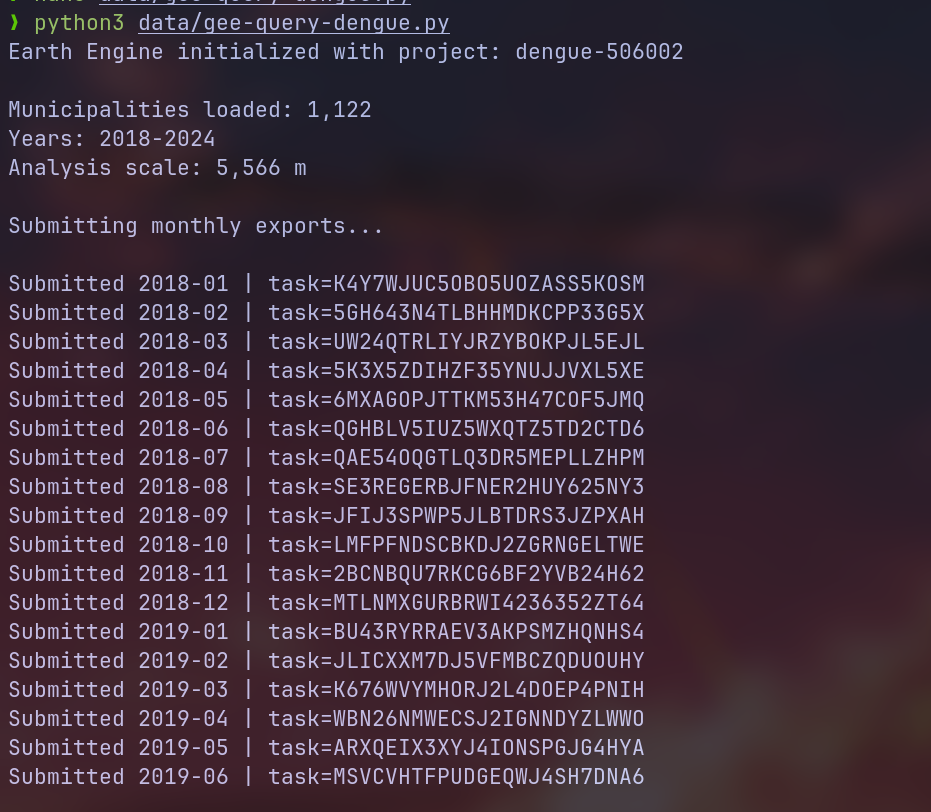
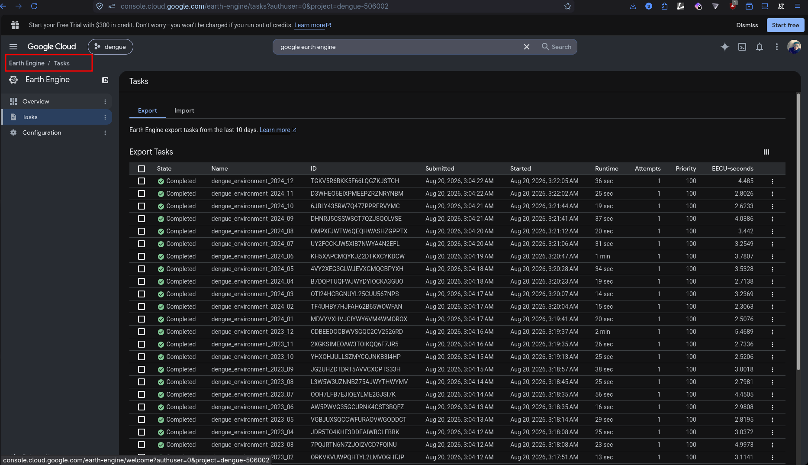

# Carga y preparación de datos DANE en Google Earth Engine

Este documento describe el proceso para cargar los municipios de Colombia desde DANE en Google Earth Engine y preparar los datos para la extracción de variables ambientales del proyecto de dengue.

## 1. Crear una cuenta en Google Earth Engine

Ingresar a Google Earth Engine:

https://earthengine.google.com/

Iniciar sesión con una cuenta de Google y solicitar acceso a Earth Engine.

Crear un proyecto con propósito:

```text
Academic / Non-commercial
```

Ejemplo de proyecto utilizado:

```text
dengue-506002
```



---

## 2. Descargar los municipios desde DANE

Descargar el archivo geográfico oficial de municipios de Colombia desde DANE.

El archivo debe incluir la información DIVIPOLA de departamentos y municipios.

Campos utilizados en este proyecto:

```text
dpto_ccdgo   Código del departamento
dpto_cnmbr   Nombre del departamento
mpio_ccdgo   Código del municipio
mpio_cdpmp   Código DIVIPOLA completo del municipio
mpio_cnmbr   Nombre del municipio
```



---

## 3. Abrir Google Earth Engine

Ingresar al Code Editor:

https://code.earthengine.google.com/

Seleccionar el proyecto creado anteriormente.



---

## 4. Cargar los archivos como Asset

En el panel izquierdo ir a:

```text
Assets
→ NEW
→ Shape files
```

Subir los archivos correspondientes al mapa de municipios.

Normalmente un Shapefile contiene archivos como:

```text
.shp
.shx
.dbf
.prj
```



Esperar hasta que Google Earth Engine termine de procesar el archivo.



El asset original utilizado en este proyecto es:

```text
projects/dengue-506002/assets/municipio-dane
```

---

## 5. Optimizar los polígonos

El archivo original de DANE puede contener geometrías complejas o múltiples polígonos.

Ejecutar:

```bash
python dane-optimized-polygons.py
```

Este script:

- Lee el Asset original de DANE.
- Identifica los municipios usando `mpio_cdpmp`.
- Une fragmentos si es necesario.
- Simplifica las geometrías.
- Conserva los códigos DIVIPOLA.
- Crea un nuevo Asset optimizado.

Asset resultante:

```text
projects/dengue-506002/assets/municipio-dane-optimized
```



---

## 6. Verificar el Asset optimizado

Se puede comprobar desde Python:

```python
import ee

ee.Initialize(project="dengue-506002")

municipios = ee.FeatureCollection(
    "projects/dengue-506002/assets/municipio-dane-optimized"
)

print("Municipios:", municipios.size().getInfo())
print(municipios.first().toDictionary().getInfo())
```

Se debe obtener información similar a:

```text
dpto_ccdgo
dpto_cnmbr
mpio_ccdgo
mpio_cdpmp
mpio_cnmbr
```

---

## 7. Ejecutar la extracción ambiental

Una vez disponible el Asset optimizado, ejecutar:

```bash
python gee-query-dengue.py
```

Este script consulta Google Earth Engine y genera datos ambientales diarios por municipio.

Variables actuales:

```text
Precipitación
Temperatura media
Punto de rocío
Humedad del suelo
Escorrentía superficial
Evaporación
Viento U
Viento V
Radiación solar
```

Cada registro queda identificado mediante:

```text
date
dpto_ccdgo
mpio_cdpmp
```



---

## 8. Revisar las tareas de exportación

Las consultas se ejecutan como tareas de Google Earth Engine.

Revisar el estado de las tareas en:

```text
Google Earth Engine
→ Tasks
```



Los archivos resultantes son exportados a Google Drive.

Ejemplo:

```text
dengue_environment_2007_01.csv
dengue_environment_2007_02.csv
dengue_environment_2007_03.csv
...
```

---

## Flujo general

```text
DANE
  ↓
Shapefile de municipios
  ↓
Google Earth Engine Asset
  ↓
dane-optimized-polygons.py
  ↓
Asset DIVIPOLA optimizado
  ↓
gee-query-dengue.py
  ↓
Datos ambientales diarios por municipio
  ↓
CSV
  ↓
Feature Engineering
  ↓
Modelo de predicción de dengue
```
